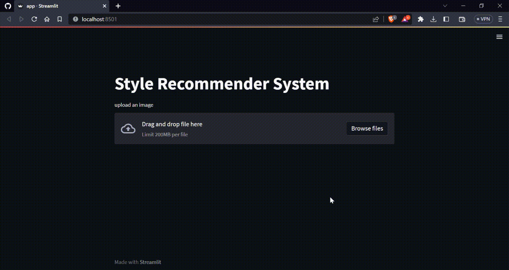

# 🥼 Fashion recommender system using RESNET50
A recommendation system (or recommender system) is a class of machine learning that uses data to help predict, narrow down, and find what people are looking for among an exponentially growing number of options. In general, these algorithms are aimed at suggesting relevant items to users, like movies to watch or products to buy. There are many types of recoommender systems, the two main are collaborative-based filtering and content-based filtering.

The one that is used in this project is a content-based image recommendation system which is used to generate similar fashion style to the user. This image retrieval technique is paired with a pre-trained model RESNET50 to achieve better results and generate most similar recommendations.

Access python files to go through the code:
- [Main](main.py) Training Model.
- [Test](test.py) Test a single image.
- [App](app.py) Source code to build webapp.

> ResNet stands for Residual Network and is a specific type of convolutional neural network (CNN). ResNet-50 is a 50-layer convolutional neural network (48 convolutional layers, one MaxPool layer, and one average pool layer). Residual neural networks are a type of artificial neural network (ANN) that forms networks by stacking residual blocks.



## 📈 Workflow

### Data Collection:
The dataset used in this project is obtained from e-commerce website which is available on kaggle [here](https://www.kaggle.com/datasets/paramaggarwal/fashion-product-images-dataset).

### Data Pre-processing:
Tensorflow provides a rich system of tools to manipulate the data in a way that it can be used to train neural networks in an efficient way. The `Image` class is used to convert an image to an array which are suitable to work with machine learning models. The dimensions of the array are expanded in order to train in multiple batches. Usally, colored images are in order of RGB color model which needs to be aligned in BGR in order to be accepted by the model. The resultant array is flattened and Nomralized to get a better result.


### Model:
- RESNET50 is used in order to reduce computing time and achieve better results.
    ```python
    model = ResNet50(weights='imagenet',include_top=False,input_shape=(224,224,3))
    model.trainable = False
    model = tensorflow.keras.Sequential([model, GlobalMaxPooling2D()])
    ```
- K-Nearest Neighbors algorithm with Euclidean distance as a metric to pick out most similar recommendations.
    ```python
    classifier = NearestNeighbors(n_neighbors=5, algorithm='brute', metric='euclidean')
    ```
